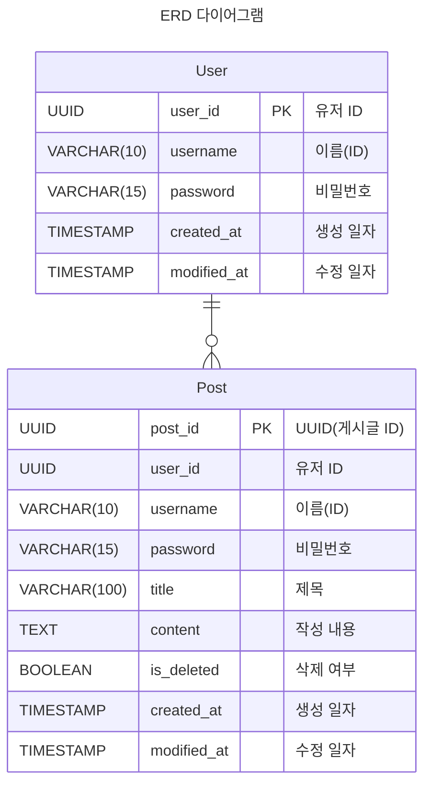

```mermaid
---
title : ERD 다이어그램
---
erDiagram
    User ||--o{ Post : ""
    User {
        UUID user_id PK "유저 ID"
        VARCHAR(10) username "이름(ID)"
        VARCHAR(15) password "비밀번호"
        TIMESTAMP created_at "생성 일자"
        TIMESTAMP modified_at "수정 일자"

    }
    Post {
        UUID post_id PK "UUID(게시글 ID)"
        UUID user_id "유저 ID"
        VARCHAR(10) username "이름(ID)"
        VARCHAR(15) password "비밀번호"
        VARCHAR(100) title "제목"
        TEXT content "작성 내용"
        BOOLEAN is_deleted "삭제 여부"
        TIMESTAMP created_at "생성 일자"
        TIMESTAMP modified_at "수정 일자"
    }
```